# VisionPitts

*Great decisions need vision. We give you one.*

A census data browser and an anti-displacement housing matchmaker for the **City of Pittsburgh**. Solo entry for the **AI Horizons 2026 · AI for Housing Hackathon**, Track 3, built Sep 26–27, 2026. Every line of code was written after the Saturday 9:00 a.m. ET kickoff.

**Live app:** [ye-zhang-vision-pitts.vercel.app](https://ye-zhang-vision-pitts.vercel.app) · **Offline:** double-click `export/index.html` · **Docs:** [plan](docs/PLAN.md) · [methods](docs/data/factor_methods.md) · [value judgments](docs/assumptions.md) · [sources](data/processed/sources.md)

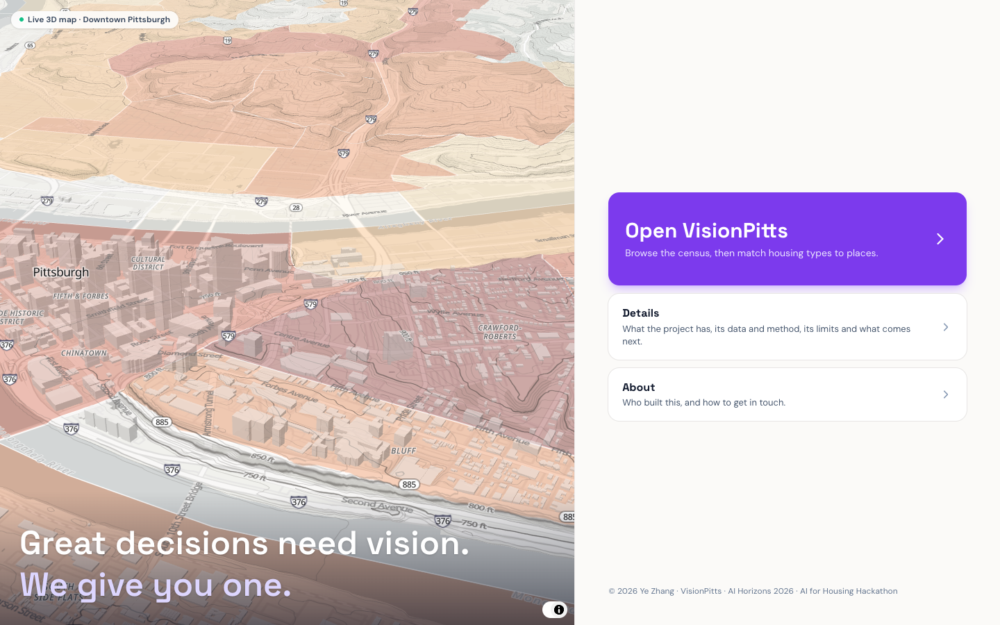

## Build timeline

- **All work began on Saturday, September 26, 2026, at the 9:00 a.m. ET kickoff.** No code, data processing or design was done before it.
- The repository was moved to this name at 3:25 p.m. on Saturday, so its first commit is timestamped 3:31 p.m. Work from 10:47 a.m. onward was carried over.
- Build window: Saturday 9:00 a.m. to Sunday 11:59 p.m. ET. Solo entry.

## What it does

The app opens on a landing page with a live 3D map. **Open VisionPitts** flies from a globe down to Pittsburgh and lands in Explore.

**Explore** is a data browser on a 3D map, kept deliberately plain: no name or logo over the map, one Home button, floating panels that fold into a small tab, and only what you ask for on screen. Choose the **area** (Pittsburgh or Allegheny County), open one **boundary** at a time (census tracts, block groups, ZIP codes, or the **129 municipalities** outside Pittsburgh), and pick a variable under **Data**, which lists the variables of whichever boundary is open: **37 ACS 2020–2024 variables** for any of them, plus the **Analysis layers** for city tracts (the eight factor percentiles, match scores under the current priorities, market pressure and the watch list, asking rents, the raw factor inputs). Buildings, terrain and hill shading sit under **Settings**. The map opens tilted; it lies flat while ⌘ (Command) is held, and whenever the view is zoomed out far enough to take in five miles around the city limits, and tilts again when you zoom back in. Hover shows the name and the value, nothing else. Click a place and the right panel becomes its summary: headline figures, tenure, housing stock, race, cost burden and commuting against the city and county, median income and rent **2014–2024**, and, for city tracts, what the matchmaker says. With a variable painted, the same click shows that variable only: value, rank, distribution and trend. Explore shows values only; margins of error and reliability are documented under Details. **One box at the top right** (in Explore and in Analysis) finds a place or answers a question: names and addresses go to the map search, which is free, and only questions go to the language model (see AI use). A **quick tour** (offered on every fresh open, and replayable from the Tour button beside Home) dims the screen except one part at a time, explains it in a sentence, and moves the map to show it: five steps for Explore, then six for Analysis if you want them (Place, Compare places, and Equity & policy). These values are **descriptive, never scored**.

**Analysis** is the Track 3 matchmaker. For any city tract it answers one question: *which housing type (ADU, duplex/triplex, townhome, small apartment, senior housing) best serves households at or below 50% of area median income without accelerating displacement?*

- **Match**: best type under your priorities, a 0–100 score, how stable the pick is, and why, factor by factor.
- **Compare scenarios**: change the weights and see every tract whose answer flips.
- **Compare tracts**: two places side by side on synced maps.
- **Copy link** puts the whole state in the URL.

| Explore | Match | Compare tracts | Compare scenarios |
|---|---|---|---|
| 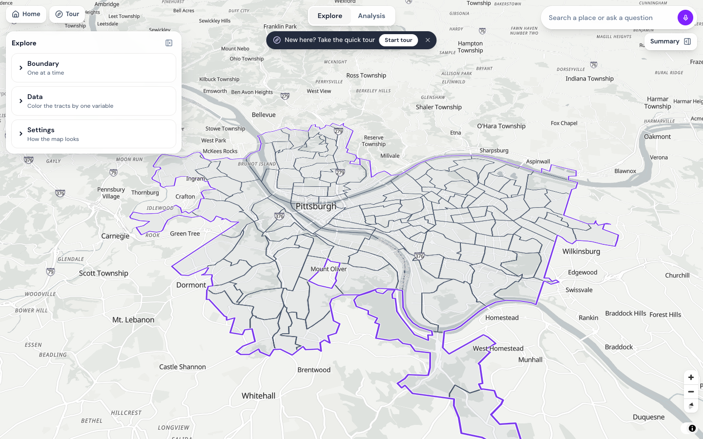 | 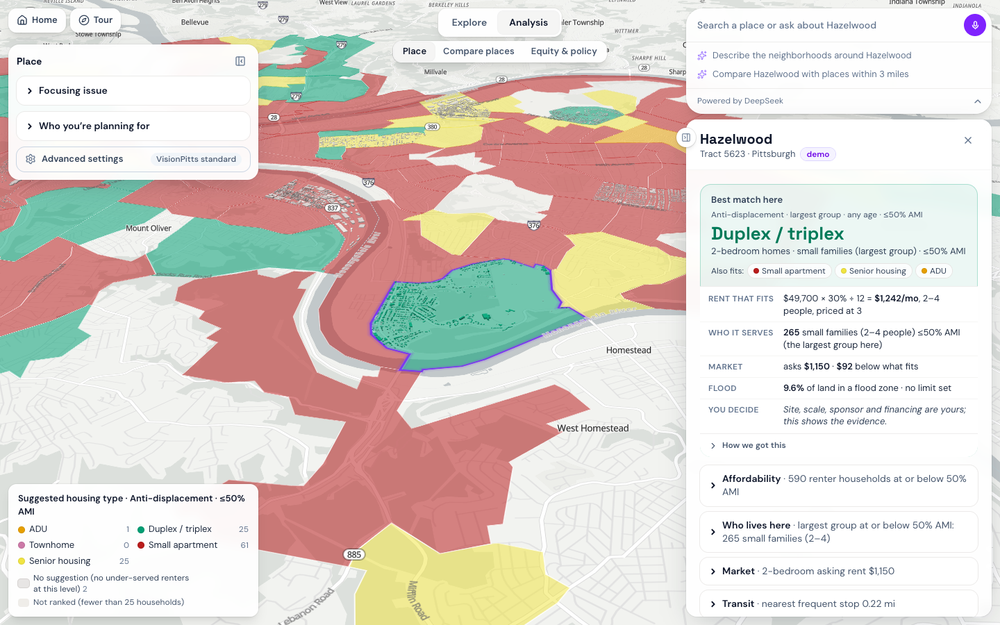 | 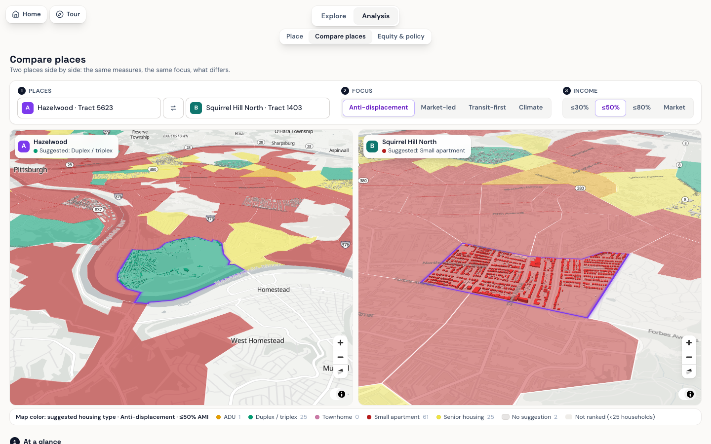 | 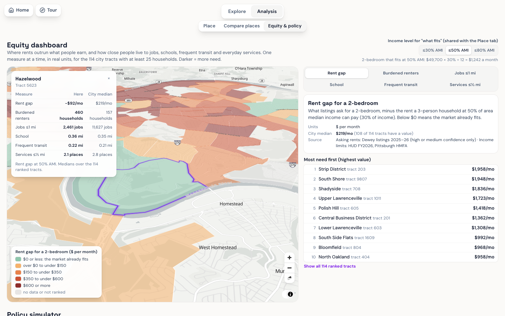 |
| **Watch list** | **Asking rents** | **Sources** | **Offline file** |
| 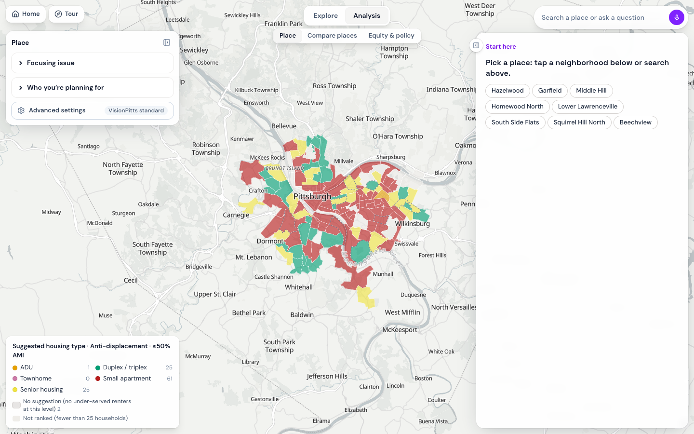 | 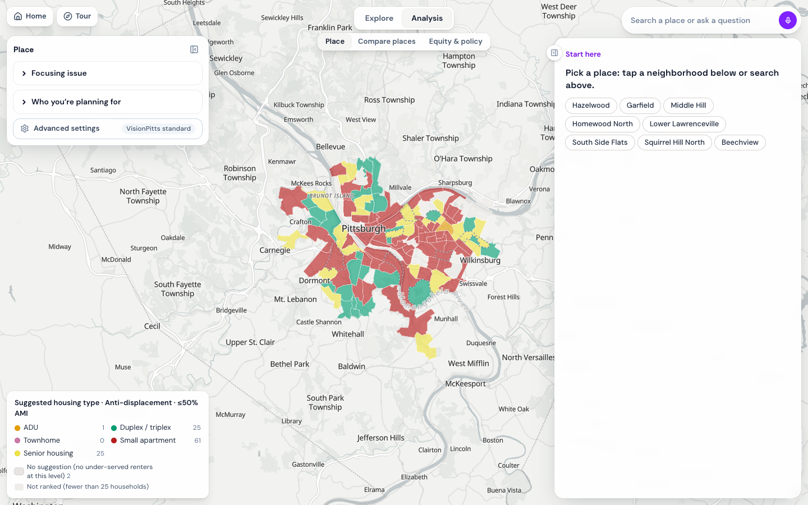 | 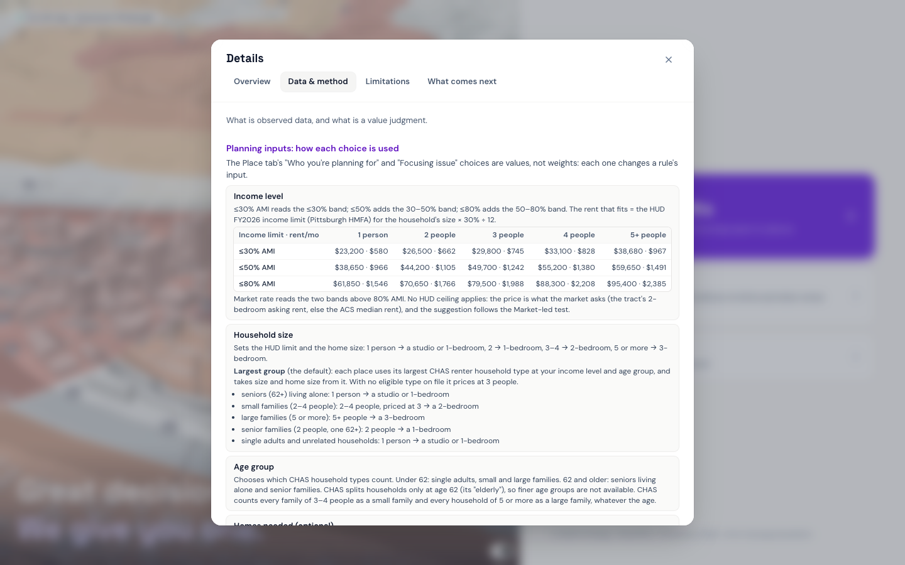 | 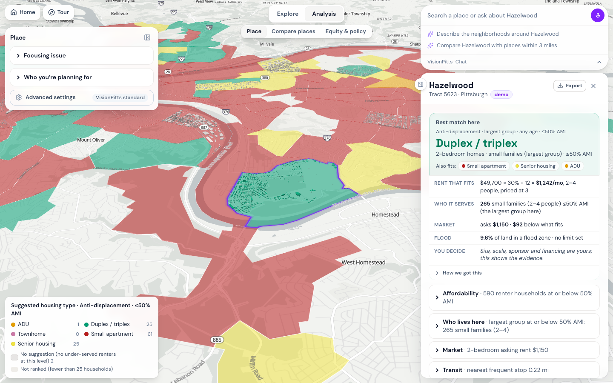 |
| **Place summary** | **One variable, one municipality** | | |
| 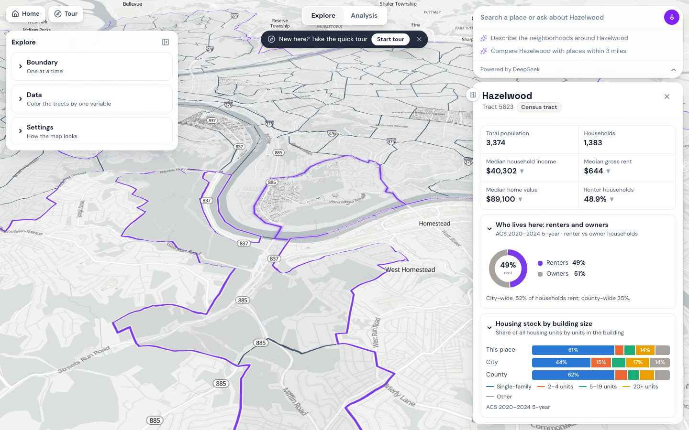 | 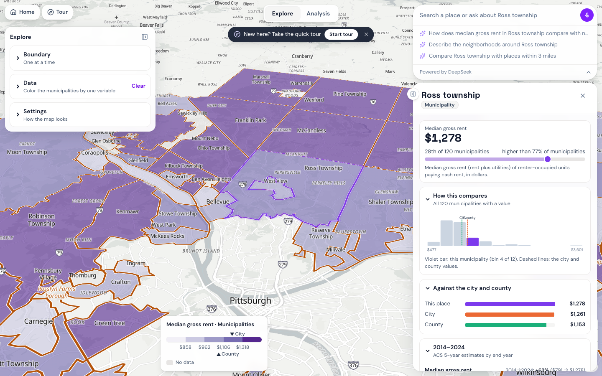 |  | 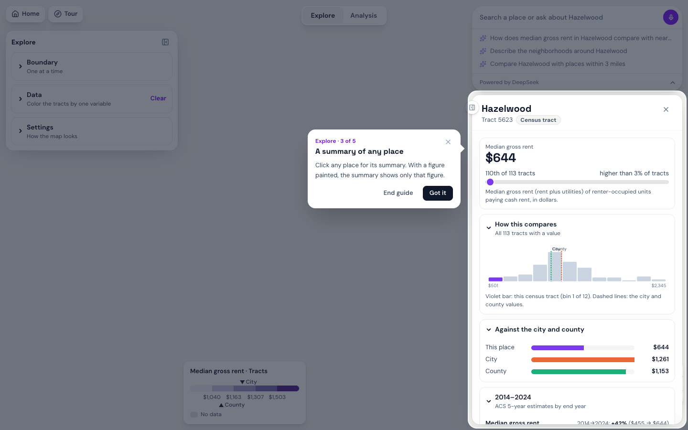 |

Made for city planners, community development corporations and mission-driven developers. The tool produces scenarios for a meeting, not verdicts.

## Quick start

```bash
# Open it
open export/index.html                 # one file of about 4.5 MB; basemap and search need internet, data is inside

# Run the app
cd app && npm install && npm run dev   # http://localhost:5173
npm test && npm run build              # 177 tests; static site in app/dist
npm run export                         # rebuild export/index.html

# Rebuild the data, in this order (Python 3.12 + uv; CENSUS_API_KEY in .env)
uv sync
uv run python scripts/01_build_tracts.py        # city tracts and crosswalk
uv run python scripts/07_build_acs_levels.py    # Explore: 37 variables x 6 geographies; also writes the two ACS shares that 02 scores
uv run python scripts/02_build_factors.py       # eight scoring factors + confidence (needs 07's acs_tract.csv)
uv run python scripts/03_build_pressure.py      # market pressure, watch list
uv run python scripts/04_export_app_data.py     # app/src/data/*.json
uv run python scripts/05_build_buildings.py     # 3D buildings, demo tracts (compact encoding)
uv run python scripts/06_build_asking_rents.py  # optional, licensed Dewey caches: asking-rent aggregates (tracts, ZIPs, municipalities)
uv run python scripts/08_publish_supabase.py    # push county-wide rows to Supabase (apply supabase/migrations first)
uv run python scripts/09_build_acs_history.py   # Explore: the same variables for every end year 2014-2024
uv run pytest                                   # 150 tests, including the numbers-in-docs check
```

**Deploy (Vercel):** Root Directory `app`; env vars `VITE_SUPABASE_URL`, `VITE_SUPABASE_ANON_KEY` (public), and optionally `DEEPSEEK_API_KEY` or `ANTHROPIC_API_KEY` for the AI explanation and the question box in both tabs.

## How the data flows

```
Census API, HUD, CDC, WPRDC, PRT ...        (public sources, see table below)
        │
        ▼  scripts/01–09 (Python)
data/processed/*.csv, *.geojson             (tracked, small)
        │
        ├──► app/src/data/*.json   city subset, bundled into the app and the offline file
        │
        └──► Supabase (Postgres)   county-wide rows, read by the live app when online
```

The app paints the bundled city data at once, then swaps in county-wide rows from Supabase when they arrive. Offline, or over `file://`, it never contacts Supabase.

## Supabase at a glance

Six tables, all read-only for the browser. Writes happen only from `scripts/08_publish_supabase.py` with the secret key. Migrations `0002_muni_level.sql` (the `muni` level and a `kind` column) and `0003_acs_history.sql` (the history table) are applied. The app works without Supabase: every municipality, 14 history variables and the rent aggregates ship inside the bundle; Supabase adds the county units outside the city and the other 23 history variables.

| Table | Rows | Columns | What it holds |
|---|---|---|---|
| `acs_variables` | 37 | `id, label, group, unit, description, table_id, sort` | The variable catalogue shown in the Data panel |
| `geo_units` | 1,757 | `level, geoid, name, kind, pgh_share, tract, geom` | Simplified GeoJSON per unit: 394 tracts, 1,062 block groups, 170 ZCTAs, 129 municipalities, county, city |
| `acs_values` | 65,009 | `level, geoid, var, est, moe, cv` | One row per unit and variable: estimate, 90% margin of error, coefficient of variation |
| `acs_history` | 282,088 | `level, geoid, year, var, est, moe, cv` | The same variables for every ACS 5-year end year 2014–2024 (tracts, ZCTAs, municipalities, county, city) |
| `dataset_versions` | 1 | `built_at, acs_year, git_sha, counts` | Which build is loaded |
| `scenarios` | 0 | `slug, owner, name, weights, fit_matrix, toggles, ...` | Reserved for saved scenarios (anonymous auth, owner-scoped); not wired yet |

`level` is one of `tract`, `bg`, `zcta`, `muni`, `county`, `city` (`acs_history` has no `bg`). GEOIDs are strings: 11 digits for tracts, 12 for block groups, 5 for ZCTAs and the county (`42003`), 10 for municipalities, 7 for the city (`4261000`).

The app makes two kinds of request, with the publishable key in the `apikey` and `Authorization: Bearer` headers, paging 1,000 rows at a time:

```
GET /rest/v1/acs_values?level=eq.bg&var=eq.med_gross_rent&select=geoid,est,moe,cv
GET /rest/v1/geo_units?level=eq.zcta&select=geoid,name,pgh_share,geom
```

Keys: the **publishable** key ships in the browser bundle and can only read, because row-level security allows `select` and nothing else. The **secret** key lives in a git-ignored `.env` on the machine that runs the loader. Schema: [`supabase/migrations/0001_init.sql`](supabase/migrations/0001_init.sql).

## Data sources

All scoring data is public. Full registry with links, retrieval dates and checksums: [`data/processed/sources.md`](data/processed/sources.md), also in the app under **Sources**.

| Used for | Dataset | Geography, period |
|---|---|---|
| Need | HUD CHAS Table 8 | tract, 2018–2022 |
| Displacement risk | CDC SVI · HUD vouchers · Eviction Lab filings | tract · tract · ZIP, 2022–2025 |
| Market strength | Reinvestment Fund MVA 2016 and 2021 (via WPRDC) | 2010 block group |
| Subsidy eligibility | HUD QCT and DDA 2026 · Opportunity Zones · CDBG areas | tract, ZCTA, 2010 geography |
| Transit access | Pittsburgh Regional Transit GTFS | stops, June 2026 |
| Flood exposure | HAND inundation on USGS 3DEP (screening model, not FEMA) | tract, 2024 |
| Residents 65+ · 2–4 unit homes | ACS 5-year 2020–2024, tables B01001 and B25024 (shares, scored as percentiles) | tract |
| Dollar scale for "50% AMI" · FMR line | HUD FY2026 income limits and Fair Market Rents, Pittsburgh HMFA (information only) | metro area |
| Explore browser | ACS 5-year 2020–2024, 37 variables | tract, block group, ZCTA, municipality, county, city |
| Explore history | ACS 5-year, end years 2014–2024, same 37 variables; 2010-vintage tracts carried to 2020 tracts by housing units ([method](docs/data/acs_history.md)) | tract, ZCTA, municipality, county, city |
| Municipal boundaries | Census cartographic county subdivisions 2023 (129 cities, boroughs and townships outside Pittsburgh) | municipality |
| Boundaries, names | Census TIGER and cartographic files · WPRDC neighborhoods | 2020 geography |
| 3D buildings | Overture footprints · WPRDC assessments (stories only) | demo tracts |
| Asking rents (info layer) | RentHub rental listings via Dewey Data, **licensed**; only aggregates leave the pipeline (yearly 2BR medians and unit counts, hidden under 10 units). Data by RentHub, licensed through Dewey Data Inc. | tract, ZCTA, municipality, 2019–2026 |
| Basemap, terrain, search | OpenFreeMap · Mapterhorn · Photon · Census Geocoder | live |

No individual-level data is used anywhere.

## Method in brief

- **Scores live on 2020 census tracts**: 128 city tracts, of which 114 with 25+ households are ranked. Percentiles are computed within the city, so "high need" means high for Pittsburgh.
- **Eight factors** (scoring v0.4.0): seven are city percentiles (need, market strength, displacement risk, transit per household, flood exposure, residents 65+, 2–4 unit homes) and subsidy eligibility is a grade of 0, 0.5 or 1. Each carries a confidence tag that varies from tract to tract.
- **Older geographies are carried forward by housing units**: 2010 block groups to 2020 tracts, ZIP filings to tracts. Each carry drops the confidence tag one level.
- **Nothing is imputed.** A missing factor is dropped and the remaining weights renormalize.
- **Explore is description only.** Sums use root-sum-square margins; shares use the ACS proportion formula; reliability is high below 15% CV, medium to 30%, low above. Two block-group substitutions (C17002 for poverty, B25044 for vehicles) are noted in the app.
- Details: [methods](docs/data/factor_methods.md), [value judgments](docs/assumptions.md).

## Limitations

- Eviction filings are apportioned from ZIPs; vouchers are suppressed in 33 of the 114 ranked tracts; market change is direction only.
- Flood exposure is a terrain screen, not a FEMA map: medium confidence at best, low in the 14 tracts where more than half the land reads as flooded. Transit access is schedule per household, not ridership.
- Explore values are survey estimates: block groups and ZCTAs often have low reliability, and ZCTAs only approximate ZIP codes.
- The 2014–2024 lines are overlapping five-year windows in each vintage's own dollars; values before 2020 for 19 city tracts were assembled from several 2010 tracts and are flagged as such.
- Analysis layers and the matchmaker block exist for the 128 city tracts only; municipalities and ZIP codes get census description and, where listed, asking rents.
- Not covered: zoning and buildability, infrastructure capacity, carbon, parcel feasibility, in-place rents.
- The fit matrix is a judgment and is published for review in [docs/assumptions.md](docs/assumptions.md), with every cell changed in v0.4.0 logged with its reason. Under Balanced weights senior housing tops 17 of 114 tracts (40 under v0.3.0, when nothing measured seniors), and duplex/triplex, which could not win before, tops 13 now that the 2–4 unit stock is measured. Many picks are close: the #1–#2 margin is under 5 points in 63 of 114 tracts, and the app says so.

## Tools used

| Tool | What it was used for |
|---|---|
| Claude Code (Anthropic) | Pair programming for the pipeline, app, tests and docs. Every change was reviewed and run by the author. |
| DeepSeek API (`deepseek-flash`) | Runtime only: the "why this ranking" sentence and answers in the search-and-question box. |
| Claude API | Optional fallback for the same two features when no DeepSeek key is set. |
| Python, uv, pandas, GeoPandas | Data pipeline and scoring. |
| Vite, React, MapLibre GL, Tailwind | The web app. |
| Supabase | Read-only county-wide data. |
| Vercel | Hosting and the two serverless AI endpoints. |
| Playwright, Vitest, pytest | Tests, smoke checks and screenshots. |

API keys live only in a git-ignored `.env` and in Vercel's encrypted environment settings. `.env.example` lists names without values. The only key that reaches a browser is Supabase's publishable read-only key on the live site, and row-level security limits it to reading published aggregates. The offline file carries no keys.

## AI use

- **Claude Code** pair-programmed the pipeline, app, tests and docs during the sprint, with every change reviewed and run by the author; commits carry co-author attribution.
- **DeepSeek** (`deepseek-flash`, thinking off) writes the optional "why this ranking" sentence in Analysis when `DEEPSEEK_API_KEY` is configured on the deployment; **Claude** (`claude-sonnet-5`) does when only `ANTHROPIC_API_KEY` is set. The model receives computed numbers only; any figure it cannot trace is rejected and a template sentence built from the same numbers is shown instead. Without a key or a balance (and in the offline file) the template sentence is always shown, and the interface names whichever model wrote the text.
- The same service answers questions typed into the **search-and-question box** (`app/api/chat.ts`). The box sorts what is typed in the browser, at no cost: a name, a ZIP code or an address is a map search; text that reads as a question goes to the model. The browser builds a facts text from figures the tool already shows: the selected place, up to eight places whose centre lies within 3 miles, the city and the county, the matchmaker's read on a city tract, and area aggregates of asking rents. The model is told to quote those figures as written and not to calculate. Every number in its answer is checked against the facts; a failed check triggers one retry. In Explore an answer that still carries an untraceable figure is shown with a warning; in Analysis it is withheld and a plain refusal is shown instead, so nothing unverified appears next to the scores. To keep the bill small, the facts are sent first so that a second question about the same place is billed at the provider's cached rate, only the last exchange is sent as history, and a question already answered is served from memory. An answer is shown after at least five seconds, with a thinking animation (the `thinking-orbs` package, MIT). Questions and facts go to the model provider; nothing is stored by the tool. The offline file has no question service and says so. The input box is adapted from a component published on 21st.dev, supplied by the author (its model picker, image attachments and simulated voice demo were removed).
- No model computes, imputes or ranks anything. Scores come from `src/visionpitts/scoring.py` and its TypeScript mirror, checked against a shared fixture of 91 scoring cases and 8 stability cases.

## Team and license

**Ye Zhang**, University of Pennsylvania, solo. MIT license, see [LICENSE](LICENSE); data remain under their original licenses.
