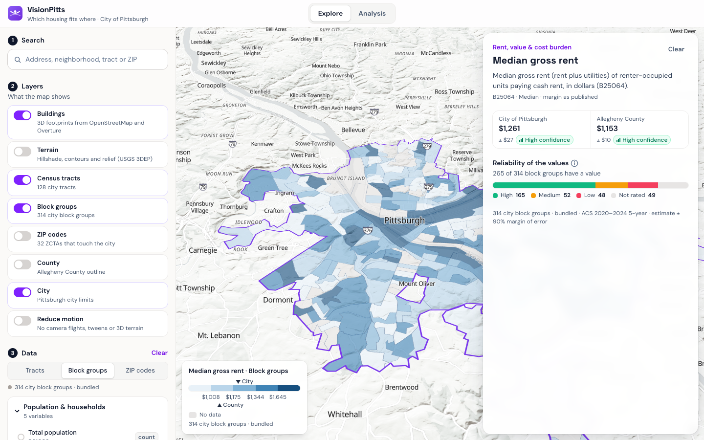

# VisionPitts

*Great decisions need vision. We give you one.*

A census data browser and anti-displacement housing typology matchmaker for the **City of Pittsburgh**. Built solo for the **AI Horizons 2026 · AI for Housing Hackathon**, Track 3 (Housing Typology, Equity & Climate Matchmaker), Sep 26–27, 2026. Every line of code in this repository was written after the Saturday 9:00 a.m. ET kickoff.

> **Open it:** `export/index.html` (double-click; one self-contained file) · **Live app:** [ye-zhang-vision-pitts-x4jg-ten.vercel.app](https://ye-zhang-vision-pitts-x4jg-ten.vercel.app) · **Plan:** [docs/PLAN.md](docs/PLAN.md) · **Methods:** [docs/data/factor_methods.md](docs/data/factor_methods.md) · **Value judgments:** [docs/assumptions.md](docs/assumptions.md)



## What it does

Two sections share one 3D map.

**Explore** is where the app opens: a census data browser. Search an address, neighborhood, tract or ZIP; switch layers on and off (3D buildings, terrain, census tracts, block groups, ZIP codes, county and city limits); pick one of 37 ACS 2020–2024 variables (population, race, income, work and education, housing stock, tenure, rent and cost burden, commuting) under **Data** and the map colors tracts, block groups or ZIP codes by it. Hover a shape for its value and 90% margin of error with a reliability chip; click it for a place card that puts every variable next to the city and the county. These values are **descriptive, never scored**. The single file bundles the city subset (128 tracts, 314 block groups, 32 ZCTAs); the hosted app loads the whole county from Supabase.

**Analysis** is the Track 3 matchmaker. One question, one map. For any City of Pittsburgh census tract: **which housing type — ADU, duplex/triplex, townhome, small apartment (5–19 units), or senior housing — best serves households at or below 50% of area median income without accelerating displacement?**

A planner or CDC staffer searches an address or picks a neighborhood, and sees:

1. **Match**: the **best match here** under the current priorities, its match score out of 100, and how solid the pick is ("Stays #1 in 7 of 10 small changes to your priorities"); then **why**, as a plain sentence built from the numbers, how the five types compare, and each observed factor with its percentile, source year and confidence tag.
2. **Market pressure**, the anti-displacement lens: whether neighboring markets are stronger than this one, and whether the tract is on the **watch list** (high need + market rising since 2016).
3. **Asking rents** (information only): the median 2-bedroom asking rent in 2025–26 against the HUD Fair Market Rent, and how much it rose since 2019–20 in buildings that already existed, from licensed listing data. Shown beside the score, never inside it.
4. **What changes when values change**: switch from *Balanced* to *Anti-displacement* weights and the ranking re-orders; **Compare scenarios** outlines every tract whose best match flips and draws a rank slopegraph for the place you picked.
5. **Compare tracts**: two places side by side on synced 3D maps, with the factors that separate them.
6. **Data limits** for that tract: what we do not know and why.

What they do next: take the shortlist into a site-prioritization meeting, a density-bonus conversation, or a CDC pipeline review. The tool produces scenarios, not verdicts. **Copy link** in the Analysis bar puts the whole state (tracts, weights, scenarios, map coloring) in the URL; Explore keeps its layers, geography and variable there too.

| Explore | Match | Compare tracts | Compare scenarios |
|---|---|---|---|
|  |  |  |  |
| **Watch list** | **Asking rents** | **Sources & method** | **Single-file export** |
|  |  |  |  |

## Who it's for

- **City planners** (Department of City Planning, URA) deciding where the voluntary affordable-housing bonus and ADU provisions should be encouraged first. Pittsburgh replaced mandatory citywide inclusionary zoning with a voluntary bonus in late 2025, so *where* the carrot is offered is now a spatial decision.
- **Community development corporations** (Hazelwood Initiative, Hill CDC, Bloomfield-Garfield Corp.) prioritizing sites and product types.
- **Mission-driven developers and advocates** (Pro-Housing PGH, ACTION-Housing) stress-testing where affordable production adds homes without flipping a neighborhood.

## How to run

**Just open it.** `export/index.html` is the whole app in one file (about 5.5 MB). It opens by double-click in Chrome, Edge or Safari; the basemap, terrain tiles and address search load from the internet, everything else is inside. If a browser blocks it over `file://`, run `export/serve.command`. Over `file://` the app never contacts Supabase, so Explore shows the bundled city subset.

**Data pipeline** (Python ≥3.12, [uv](https://docs.astral.sh/uv/)). Raw downloads go in `data/raw/` (git-ignored; URLs and checksums in `data/processed/sources.md`).

```bash
cp .env.example .env            # add CENSUS_API_KEY (free key from api.census.gov); SUPABASE_* only for step 8
uv sync
uv run python scripts/01_build_tracts.py      # city tracts, ACS context, demo tracts, 2010->2020 crosswalk
uv run python scripts/02_build_factors.py     # every source -> six factors + confidence tags + sources registry
uv run python scripts/03_build_pressure.py    # spatial lag, bivariate classes, watch list, flip list
uv run python scripts/04_export_app_data.py   # writes app/src/data/*.json and data/processed/tracts.geojson
uv run python scripts/05_build_buildings.py   # 3D buildings for the demo tracts (Overture + assessment stories)
uv run python scripts/06_build_asking_rents.py # optional: asking rents from the licensed Dewey caches in data/raw/dewey_cache -> information layer; re-runs step 4
uv run python scripts/07_build_acs_levels.py   # Explore browser: 37 ACS variables for tracts, block groups, ZCTAs, county and city (API pulls cached in data/raw/acs)
uv run python scripts/08_publish_supabase.py   # optional: upsert the county-wide rows to Supabase (needs SUPABASE_URL + SUPABASE_SECRET_KEY; try --dry-run first)
uv run python scripts/make_parity_fixture.py  # 40 scoring cases shared by the Python and TypeScript engines
uv run pytest                                  # 45 tests
```

**App** (Vite + React + MapLibre GL). The scoring engine runs in the browser; data is imported at build time.

```bash
cd app && npm install
npm run dev        # http://localhost:5173
npm test           # 38 tests: engine parity, explanation number check, URL hash, formatting
npm run build      # static site in app/dist (what Vercel deploys)
npm run export     # ONE self-contained file: export/index.html
npm run shoot      # Playwright smoke test + screenshots (dev server must be running)
```

**Deploy on Vercel:** import the repo, set **Root Directory = `app`** (framework Vite is auto-detected), and add three environment variables: `ANTHROPIC_API_KEY` for the AI explanation endpoint (`app/api/explain.ts`; without it the app shows a template sentence built from the same numbers), and `VITE_SUPABASE_URL` + `VITE_SUPABASE_ANON_KEY` so Explore can load county-wide rows (the publishable key only; row-level security keeps the tables read-only; without the pair the browser shows the bundled city subset). The browser never sees a secret: the Anthropic key stays in the serverless function and the Supabase secret key is used only by `scripts/08_publish_supabase.py` on your machine.

## Data sources

Every scoring source is public. The one licensed source (Dewey rental listings) feeds an information layer only, and only tract-level aggregates leave the pipeline. The Explore browser's census variables are public and descriptive: they color the map and fill the place card, and none of them enters a score. Geography is the 2020 census tract for scoring; the browser adds block groups, ZCTAs, the county and the city. Anything published on 2010 geography or by ZIP is reconciled as described in the next section. The generated registry with retrieval dates and checksums is [`data/processed/sources.md`](data/processed/sources.md); the same table is in the app under **Sources** (logo → About → Sources).

| Dataset | Source (link) | Geography | Period | Notes |
|---|---|---|---|---|
| CHAS Table 8: renters by income band and cost burden | [HUD CHAS 2018–2022](https://www.huduser.gov/portal/datasets/cp.html) | 2020 tract | 2018–2022 | `need` count (renters ≤50% HAMFI) and cost-burden share. HUD rounds counts; small tracts have large MOEs. |
| Social Vulnerability Index | [CDC/ATSDR SVI 2022, Pennsylvania](https://www.atsdr.cdc.gov/place-health/php/svi/index.html) | 2020 tract | 2022 (ACS 2018–22) | State percentile ranks, re-ranked within the city. |
| Housing Choice Vouchers by tract | [HUD Open Data](https://hudgis-hud.opendata.arcgis.com/datasets/HUD::housing-choice-vouchers-by-tract) | 2020 tract | through 12/2025 | Suppressed where ≤10 holders (null, not zero). |
| Eviction Tracking System, Pittsburgh | [Eviction Lab](https://evictionlab.org/eviction-tracking/pittsburgh-pa/) | ZIP, monthly | 2023–2025 mean (file updated Sep 2026) | Apportioned to tracts by housing units; tagged as an estimate. |
| Market Value Analysis 2021 and 2016 | [Reinvestment Fund via WPRDC](https://data.wprdc.org/dataset/market-value-analysis) | 2010 block group | 2021, 2016 | Letter categories → ordinal within vintage; 2016→2021 used for direction only. |
| LIHTC Qualified Census Tracts; Small-Area DDAs | [HUD QCT/DDA 2026](https://www.huduser.gov/portal/datasets/qct.html) | tract; ZCTA | 2026 | DDA assigned by largest ZCTA overlap. |
| Opportunity Zones | [HUD Open Data](https://hudgis-hud.opendata.arcgis.com/datasets/HUD::opportunity-zones) | 2010 tract | 2018 designation | Crosswalked by housing units. |
| CDBG-eligible block groups | [City of Pittsburgh via WPRDC](https://data.wprdc.org/dataset/cdbg-eligible-block-groups) | 2010 block group | 2018 (HUD LMISD) | City only, which matches this tool's scope. |
| GTFS static feed | [Pittsburgh Regional Transit](https://www.rideprt.org/business-center/developer-resources/) | stop | June 2026 feed | Weekday departures within 400 m per acre. Schedule, not ridership. |
| HAND flood inundation share | Coursework output (MUSA 6950) on [USGS 3DEP](https://www.usgs.gov/3d-elevation-program) | 2020 tract | 2024 | Screening model, **not** FEMA. |
| ACS 5-year estimates + MOE | [Census API, ACS 2020–2024](https://api.census.gov/data/2024/acs/acs5) | 2020 tract | 2020–2024 | Context only; CV shown. |
| ACS 5-year, Explore data browser (37 variables) | [Census API, ACS 2020–2024](https://api.census.gov/data/2024/acs/acs5) | tract, block group, ZCTA, county, place | 2020–2024 | **Descriptive, never scored.** Estimate, 90% MOE and CV per value; sums root-sum-square, shares by the ACS proportion formula; B25044 (vehicles) and C17002 (poverty) stand in for tables not published at block-group level. City subset bundled; county-wide rows from Supabase when online. |
| Block-group, county and ZCTA boundaries | [Census cartographic boundaries 2023](https://www.census.gov/geographies/mapping-files/time-series/geo/cartographic-boundary.html) (block groups, county); [TIGERweb 2020](https://tigerweb.geo.census.gov/) (ZCTAs) | block group, county, ZCTA | 2023 (2020 geography) | Simplified in EPSG:2272 (5 m block groups, 10 m the rest). City membership: block groups ≥ 50% of area inside the city, ZCTAs ≥ 1%. ZCTAs approximate ZIP codes and do not nest in the city. |
| Tract, place, block and block-group boundaries | [Census TIGER/Line and cartographic files](https://www.census.gov/geographies/mapping-files.html) | various | 2020 / 2023 | Geometry, city clip, crosswalk weights. |
| ZIP Code Tabulation Areas | [Census TIGERweb](https://tigerweb.geo.census.gov/) | ZCTA | 2020 | DDA and eviction assignment. |
| Pittsburgh neighborhoods | [WPRDC](https://data.wprdc.org/dataset/neighborhoods2) | neighborhood | current | Labels and search. |
| Building footprints (demo tracts) | [Overture Maps](https://docs.overturemaps.org/guides/buildings/) | building | 2026-09 | 3D display only. |
| Parcels and property assessments (demo tracts) | [WPRDC parcels](https://data.wprdc.org/dataset/allegheny-county-parcel-boundaries), [assessments](https://data.wprdc.org/dataset/property-assessments) | parcel | 2026 | Only STORIES and YEARBLT are read, for building heights. No owner, sale or value fields. |
| Asking rents from rental listings (**information layer, never scored**) | [Dewey Data](https://www.deweydata.io/) rental listings, Pennsylvania (licensed, academic subscription) | listing point → 2020 tract | scrapes 2014 – Aug 2026; layer uses 2019–2026 | Median 2BR asking rent 2025–26 vs the FY2026 FMR ($1,299), growth since 2019–20 for existing stock, bedroom-mix index. Market-rate skew. Dewey's terms allow publishing summary insights but not the licensed rows (§3.2), so raw files stay in git-ignored `data/raw/dewey_cache` and cells under 10 distinct units (20 pooled) are hidden. |
| Basemap, elevation, geocoding (runtime) | [OpenFreeMap](https://openfreemap.org), [Mapterhorn](https://mapterhorn.com) (USGS 3DEP), [Photon](https://photon.komoot.io), [US Census Geocoder](https://geocoding.geo.census.gov/) | tiles / addresses | live | Display and search only; never scored. |

No individual-level data is used anywhere.

## How we reconciled the data

Full detail in [docs/data/factor_methods.md](docs/data/factor_methods.md). The short version:

- **One geography for scoring.** Everything that enters a score lands on 2020 census tracts. The study set is the 128 tracts with at least half their area inside the Pittsburgh city limits; 14 of them have fewer than 25 households (parks, rivers, stadium land, campuses) and are shown but never ranked, leaving **114 ranked tracts**. The Explore browser adds block groups, ZCTAs, the county and the city as read-only description; none of it enters a score.
- **2010 → 2020.** MVA, Opportunity Zones and CDBG are published on 2010 geography. Every 2020 block is placed by its internal point into a 2010 block group, and values are carried to 2020 tracts in proportion to 2020 housing units. Designations become "share of the tract's housing units that were designated" and flag at ≥50%. Where a tract's 2010 dominant share is under 0.8 (its boundary changed a lot), confidence drops a level.
- **ZIP → tract.** Eviction filings are monthly by ZIP. Annual filings (2023–2025 mean) are split among tracts by the housing units of the blocks inside each ZCTA and expressed per 100 renter households. This is an apportioned estimate, and every use of it drops the displacement confidence tag one level.
- **Periods.** Sources span 2016 to 2026. Each factor carries its data year in the app, and the confidence tag starts from data age (≤2 years high, 3–5 medium, older low).
- **Definitions.** MVA letters are ordinal within a vintage only, so 2016→2021 change is used for direction alone. HAMFI is treated as AMI. CHAS cost-burden shares are clipped at 1 because HUD rounding can push a part above its whole. Missing components are dropped and weights renormalize; nothing is imputed.
- **Percentiles, not raw values, enter the score**, computed across the 114 ranked city tracts, so "high need" means high for Pittsburgh.
- **Listings → tracts (information layer).** Each rental listing is placed in its 2020 tract by its coordinates and counted once per unit per scrape month. "Existing stock" means a building's site was listed before 2019; Dewey re-keys its property ids over time (none of the 2025 ids appear before 2019), so the site is the geocoded location rounded to about 10 m.

## Limitations

Stated in the app per tract (the *Data limits* panel) and here in general:

- **Eviction filings are apportioned from ZIPs**, not observed at tract level. Tract rates inherit their ZIP's pattern.
- **Vouchers are suppressed** by HUD in tracts with ≤10 holders (47 ranked tracts), so those tracts' displacement score rests on fewer parts and is tagged low.
- **Market change is direction only.** MVA 2016 and 2021 categories are not comparable one to one, and 20 city tracts have no market classification at all (mostly non-residential or campus land).
- **Flood exposure is a terrain screening model** (HAND), not a FEMA floodplain; it ignores stormwater and flash flooding.
- **Transit access is schedule, not service quality**, and the 400 m buffer crosses tract lines, so small dense tracts score very high.
- **Need counts households, not fit for a typology.** Student-heavy tracts (Oakland) rank high on the count and the tool does not adjust for that.
- **The city is the universe.** Neighbors outside the city are not in the spatial-lag computation, so edge tracts have fewer neighbors.
- **3D buildings** exist for the eight demo tracts only; elsewhere the map shows OpenStreetMap buildings at default heights. Guessed heights are drawn faded and counted in the data-limits panel.
- **Asking rents are information, not a factor.** They come from licensed Dewey listing data with a market-rate skew (subsidized and long-tenure units are absent), and existing-stock growth has no positive relation to the market signals the score uses (Spearman 0.03 with market strength, −0.31 with the 2016→2021 market change). The 2019–20 scrape is thin, so existing-stock growth exists for 30 of 114 ranked tracts and all-listings growth for 51; 108 of 128 city tracts have a 2025–26 level. Judges cannot open the source, so scored factors stay public-data only.
- **Explore values are survey estimates.** Block-group and ZCTA figures often carry coefficients of variation above 30% (shown as low reliability), campus tracts have few households, and ZCTAs only approximate USPS ZIP codes. Offline, the browser shows the city subset only.
- **Not integrated, and the tool does not claim to answer them:** zoning and what is buildable by right, infrastructure capacity, embodied carbon and VMT, land availability and parcel-level feasibility, contract (in-place) rents.
- **The fit matrix is a judgment.** Under Balanced weights senior housing ranks first in 40 of 114 tracts, largely because its fit row is short and strongly flood-averse; this is documented in [docs/assumptions.md](docs/assumptions.md) for review rather than tuned to look better.

## Human-in-the-loop

The tool never says "build X here." It ranks options under weights the user sets, shows how often that ranking survives random nudges to the weights, and outlines the tracts where the answer depends on values. Concretely:

- **Every consequential number has a visible owner.** Factor values are observed and carry a source, year and confidence tag; the fit matrix, presets and weights are labeled value judgments and can be changed by the user in the app or in `config/scoring.json`.
- **The intended use is a meeting, not an auto-decision.** A planner or CDC brings a shortlist and the flip map into a site-prioritization or bonus-eligibility conversation; nothing in the tool grants eligibility, funding or approval.
- **AI writes prose, never numbers.** The optional Claude explanation receives only computed values and is rejected if any figure in its text cannot be traced to them; the app then shows a template sentence instead.
- **Disagreement is a feature.** Saved scenarios, the slopegraph and the flip outlines exist so two people with different priorities can see exactly which tracts they disagree about.

## AI tools used

- **Claude Code (Claude Fable 5.1)** pair-programmed the pipeline, app, tests and documentation with the author during the sprint. Commit messages carry co-author attribution.
- **Claude (Sonnet 5 by default)** powers the in-app explanation endpoint (`app/api/explain.ts`) on the deployed site. It receives computed values only, is instructed not to compute anything, and its output passes a number-check before display. The single-file export shows the template sentence instead.
- No model computes, imputes or ranks anything. All scores come from `src/visionpitts/scoring.py` and its TypeScript mirror, verified against a shared 40-case fixture.

## Team

- **Ye Zhang** — product, data pipeline, scoring method, app, documentation (solo entry).

## License

MIT. See [LICENSE](LICENSE). Data remain under their original licenses (see the sources table).
